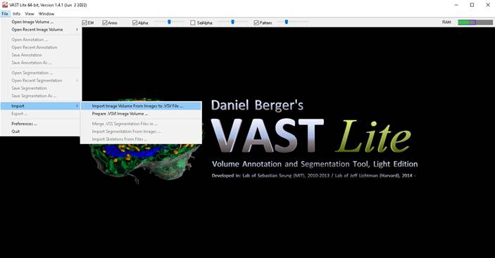
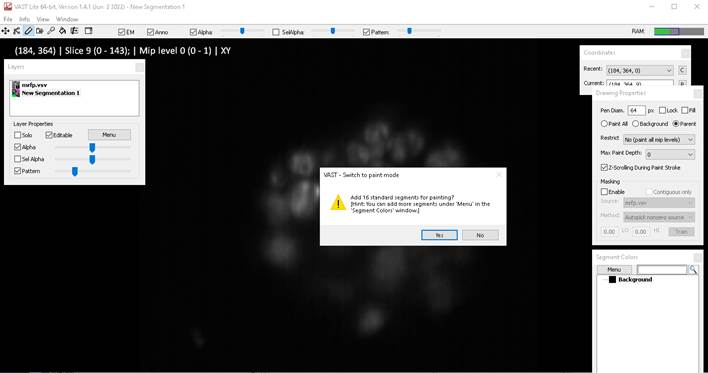
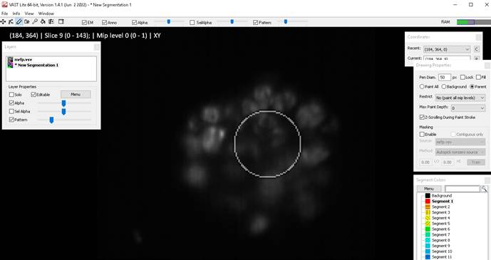
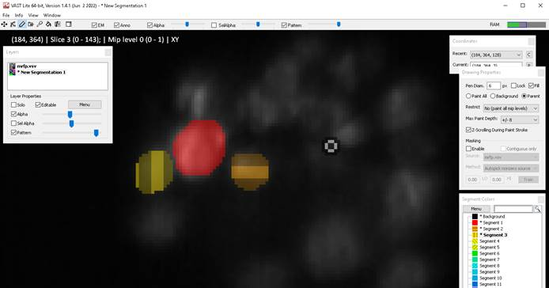
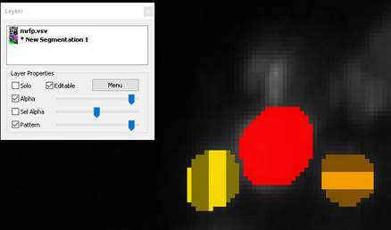
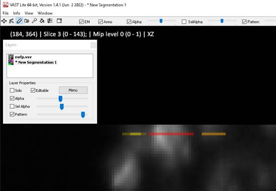
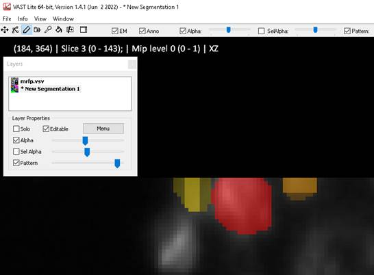

Annotation of dataset with VAST
===============================

Firstly, import the image stack for segmentation which must be 8-bit. You will
be prompted on import settings (it’s self-explanatory).

Once you import, add a new segmentation layer and you have the option to add 16
empty segments.

Use - and + keys to change size of brush, hold right-click while you paint to
erase. If you change the plane (up and down arrow keys) while painting (holding
left click or drawing with pen) you can paint the other planes up to the maximum
paint depth. I tend to just do everything plate by plane.

Ticking fill allows you to draw a boundary and it automatically fills the
inside.

You can freely change the brightness of the image layer or the segmentation
layer as you go.

If you want to segment in 3D e.g. for Stardist or intend to also train the model
on XZ and YZ slices, it can be a good idea to segment in the different views
(under view menu)

Go through the full stack, changing the current slice with up and down arrow
keys, annotating with unique segments as you go and adding new ones as
necessary.

Once everything has been annotated Simply export as TIFF to get the XY slices of
the segmentation/annotation. Use FIJI/ImageJ load these and reslice to get XZ
and YZ slices.

 

Install Cellpose
================

I don’t think the order matters, but if you want Cellpose to use GPU you need to
follow install instructions for pytorch (I’m assuming basic knowledge of python
package installing here)

[https://pytorch.org/get-started/locally/  
](https://pytorch.org/get-started/locally/)

~~~~~~~~~~~~~~~~~~~~~~~~~~~~~~~~~~~~~~~~~~~~~~~~~~~~~~~~~~~~~~~~~~~~~~~~~~~~~~~~
> pip3 install cellpose
> pip3 install torch torchvision torchaudio --index-url https://download.pytorch.org/whl/cu118
~~~~~~~~~~~~~~~~~~~~~~~~~~~~~~~~~~~~~~~~~~~~~~~~~~~~~~~~~~~~~~~~~~~~~~~~~~~~~~~~

Run Cellpose training
=====================

Note: Cellpose 3 differs from Cellpose 2 in that the train function is now
separated into a model to identify size in the data, train_size, and the main
model to find the segmentation, train_seg—I only use train_seg.

Cellpose will train a model on a given object size and the pretrained models use
30 px for cells and 17 px for nuclei. When the model is evaluated, the data is
scaled based on the diameter of your objects, given by mean_diam. I’m still
slightly unclear on this. See: [https://github.com/MouseLand/cellpose/issues/632  
](https://github.com/MouseLand/cellpose/issues/632)

An example of training a Cellpose model is shown in the
[training_new_cellpose.ipynb](https://github.com/LeoRoweBrown/IBIN_Nina_code/blob/main/cellpose/training_new_cellpose.ipynb)
notebook

Run Cellpose segmentation
=========================

An example of running a Cellpose model for a single volume (multipage TIFF
stack) is shown in the
[segment_single_vol.ipynb](https://github.com/LeoRoweBrown/IBIN_Nina_code/blob/main/cellpose/segment_single_vol.ipynb)
notebook.

An example of running a Cellpose model for an entire OPM dataset (TIFF sequence
in a folder) is shown in the
[segment.ipynb](https://github.com/LeoRoweBrown/IBIN_Nina_code/blob/main/cellpose/segment.ipynb)
notebook.
